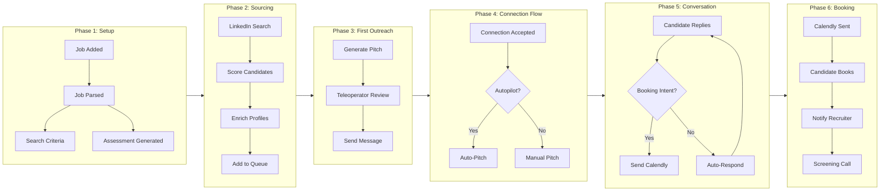
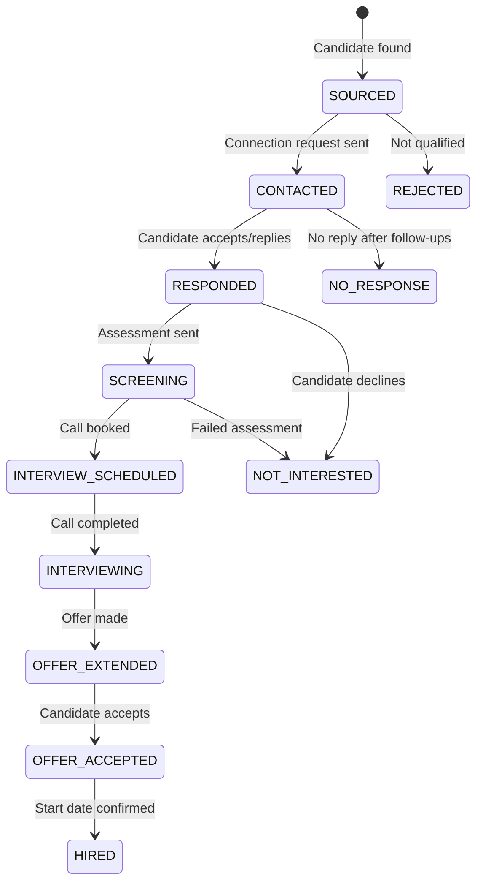
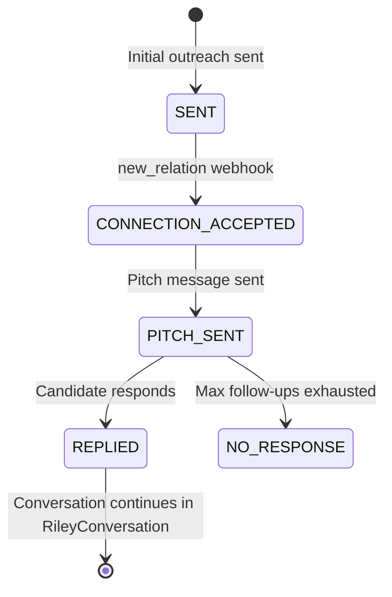
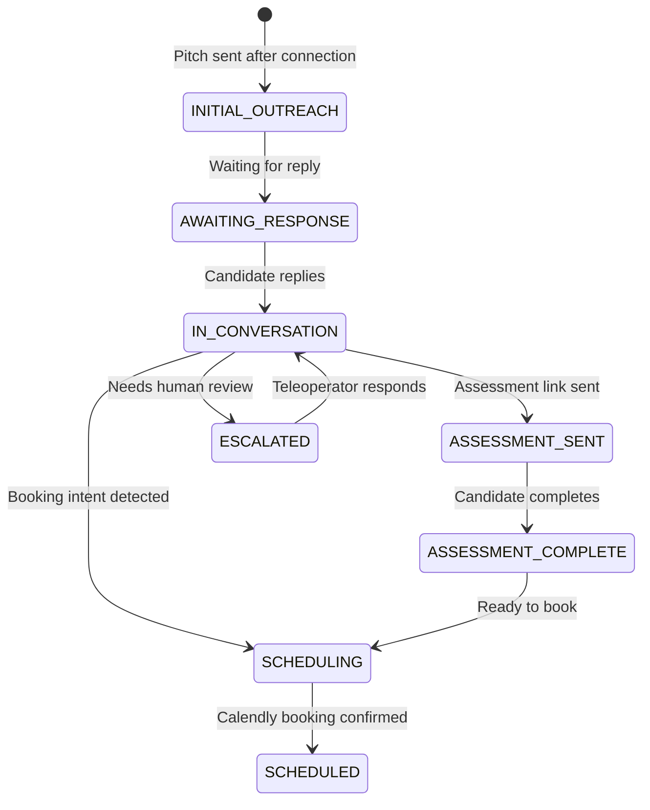

# Riley Recruiter - Complete Workflow Diagram

## Full Autonomous Sourcer Pipeline

```mermaid
flowchart TB
    subgraph INTAKE["1. JOB INTAKE"]
        JOB_ADD[/"Job Added"/]
        JOB_PARSE["Job is Parsed<br/>(JobDescriptionParser)"]
        JOB_ADD --> JOB_PARSE
    end

    subgraph GENERATION["2. AI GENERATION"]
        SEARCH_CRITERIA["AI Search Criteria<br/>Generated<br/>(AIQueryGenerator)"]
        ASSESSMENT_GEN["Pre-Interview Assessment<br/>Generated<br/>(AIAssessmentGenerator)"]

        JOB_PARSE --> SEARCH_CRITERIA
        JOB_PARSE --> ASSESSMENT_GEN
    end

    subgraph ASSESSMENT_SETUP["Assessment Setup"]
        ASSESSMENT_PAGE["Assessment Added<br/>to Assessment Page"]
        ASSESSMENT_DROPDOWN["Assessment Added to<br/>Queue Template Dropdown"]

        ASSESSMENT_GEN --> ASSESSMENT_PAGE
        ASSESSMENT_GEN --> ASSESSMENT_DROPDOWN
    end

    subgraph SOURCING["3. LINKEDIN SOURCING"]
        SEARCH_EXEC["Search Executed<br/>via LinkedIn API<br/>(UnipileClient)"]
        SEARCH_RESULTS["Search Results<br/>Returned"]
        CANDIDATES_SCORED["Candidates Scored<br/>(AISourcingScorer)"]
        PROFILES_ENRICHED["Profiles Enriched<br/>& Re-Scored<br/>(AICandidateScorer)"]

        SEARCH_CRITERIA --> SEARCH_EXEC
        SEARCH_EXEC --> SEARCH_RESULTS
        SEARCH_RESULTS --> CANDIDATES_SCORED
        CANDIDATES_SCORED --> PROFILES_ENRICHED
    end

    subgraph OUTREACH_PREP["4. OUTREACH PREPARATION"]
        QUALIFIED_QUEUE["Qualified Candidates<br/>Added to Approval Queue"]
        PITCH_GENERATED["Pitch Message Generated<br/>(AIOutreachGenerator)"]

        PROFILES_ENRICHED --> QUALIFIED_QUEUE
        QUALIFIED_QUEUE --> PITCH_GENERATED
    end

    subgraph APPROVAL["5. TELEOPERATOR APPROVAL"]
        QUEUE_REVIEW["Approval Queue<br/>Reviewed by Teleoperator"]
        EDIT_PITCH["Teleoperator Reviews<br/>& Edits Pitch"]

        PITCH_GENERATED --> QUEUE_REVIEW
        QUEUE_REVIEW --> EDIT_PITCH
    end

    subgraph FIRST_OUTREACH["6. FIRST OUTREACH"]
        SEND_CONNECTION["Send Connection Request<br/>(with note)"]
        SEND_INMAIL["Send InMail<br/>(2nd/3rd degree)"]
        SEND_DM["Send Direct Message<br/>(1st degree)"]
        OUTREACH_TRACKER["OutreachTracker Created<br/>(status: SENT)"]

        EDIT_PITCH --> SEND_CONNECTION
        EDIT_PITCH --> SEND_INMAIL
        EDIT_PITCH --> SEND_DM
        SEND_CONNECTION --> OUTREACH_TRACKER
        SEND_INMAIL --> OUTREACH_TRACKER
        SEND_DM --> OUTREACH_TRACKER
    end

    subgraph WEBHOOK_HANDLING["7. WEBHOOK EVENTS"]
        WEBHOOK_RECEIVE["Webhook Received<br/>(Unipile)"]
        CONNECTION_ACCEPTED["new_relation:<br/>Connection Accepted"]
        MESSAGE_RECEIVED["message_received:<br/>Candidate Replied"]

        OUTREACH_TRACKER -.->|"Wait for response"| WEBHOOK_RECEIVE
        WEBHOOK_RECEIVE --> CONNECTION_ACCEPTED
        WEBHOOK_RECEIVE --> MESSAGE_RECEIVED
    end

    subgraph CONNECTION_FLOW["8. CONNECTION ACCEPTANCE FLOW"]
        UPDATE_TRACKER_CONN["Update OutreachTracker<br/>(CONNECTION_ACCEPTED)"]
        CHECK_AUTOPILOT{"Autopilot<br/>Enabled?"}
        AUTO_PITCH["Auto-Send Pitch<br/>(PitchSequenceService)"]
        MANUAL_PITCH["Queue for Manual<br/>Pitch Approval"]
        RILEY_CONV_CREATE["RileyConversation Created<br/>(stage: INITIAL_OUTREACH)"]

        CONNECTION_ACCEPTED --> UPDATE_TRACKER_CONN
        UPDATE_TRACKER_CONN --> CHECK_AUTOPILOT
        CHECK_AUTOPILOT -->|"Yes"| AUTO_PITCH
        CHECK_AUTOPILOT -->|"No"| MANUAL_PITCH
        AUTO_PITCH --> RILEY_CONV_CREATE
        MANUAL_PITCH -->|"Approved"| RILEY_CONV_CREATE
    end

    subgraph CONVERSATION["9. CONVERSATION AUTOMATION"]
        CONV_STAGE_UPDATE["Update Stage:<br/>IN_CONVERSATION"]
        CHECK_RILEY_INIT{"Riley-Initiated<br/>Conversation?"}
        IGNORE_MSG["Log & Ignore<br/>(not Riley's conversation)"]
        PROCESS_MSG["Process Message"]

        MESSAGE_RECEIVED --> CHECK_RILEY_INIT
        CHECK_RILEY_INIT -->|"No"| IGNORE_MSG
        CHECK_RILEY_INIT -->|"Yes"| PROCESS_MSG
        RILEY_CONV_CREATE -.->|"Candidate replies"| MESSAGE_RECEIVED
        PROCESS_MSG --> CONV_STAGE_UPDATE
    end

    subgraph RESPONSE_ANALYSIS["10. RESPONSE ANALYSIS"]
        DETECT_INTENT["Detect Intent<br/>(BookingIntentDetector)"]
        CHECK_ESCALATION{"Escalation<br/>Required?"}
        ESCALATE["Escalate to<br/>Teleoperator"]

        CONV_STAGE_UPDATE --> DETECT_INTENT
        DETECT_INTENT --> CHECK_ESCALATION
        CHECK_ESCALATION -->|"Yes (salary, visa, etc.)"| ESCALATE
    end

    subgraph BOOKING_FLOW["11. BOOKING INTENT DETECTED"]
        BOOKING_DETECTED["Strong Booking<br/>Intent Detected"]
        GET_CALENDLY["Get Calendly Link<br/>(CalendlyRotatorService)"]
        SEND_CALENDLY["Send Response<br/>with Calendly Link"]
        ASSIGNMENT_CREATE["CalendlyLinkAssignment<br/>Created"]
        STAGE_SCHEDULING["Update Stage:<br/>SCHEDULING"]

        CHECK_ESCALATION -->|"No + Booking Intent"| BOOKING_DETECTED
        BOOKING_DETECTED --> GET_CALENDLY
        GET_CALENDLY --> SEND_CALENDLY
        SEND_CALENDLY --> ASSIGNMENT_CREATE
        ASSIGNMENT_CREATE --> STAGE_SCHEDULING
    end

    subgraph AUTO_RESPONSE["12. AUTO-RESPONSE (No Booking Intent)"]
        GENERATE_RESPONSE["Generate Response<br/>(RileyAutoResponder)"]
        SEND_RESPONSE["Send Response<br/>via LinkedIn"]

        CHECK_ESCALATION -->|"No + No Booking Intent"| GENERATE_RESPONSE
        GENERATE_RESPONSE --> SEND_RESPONSE
        SEND_RESPONSE -.->|"Candidate replies again"| MESSAGE_RECEIVED
    end

    subgraph ASSESSMENT_FLOW["13. ASSESSMENT FLOW (Optional)"]
        SEND_ASSESSMENT["Send Assessment Link<br/>to Candidate"]
        STAGE_ASSESSMENT["Update Stage:<br/>ASSESSMENT_SENT"]
        CANDIDATE_COMPLETES["Candidate Completes<br/>Assessment"]
        SCORE_ASSESSMENT["Score Assessment<br/>(AssessmentScorer)"]
        STAGE_ASSESSED["Update Stage:<br/>ASSESSMENT_COMPLETE"]

        GENERATE_RESPONSE -->|"If assessment needed"| SEND_ASSESSMENT
        SEND_ASSESSMENT --> STAGE_ASSESSMENT
        STAGE_ASSESSMENT -.->|"Wait"| CANDIDATE_COMPLETES
        CANDIDATE_COMPLETES --> SCORE_ASSESSMENT
        SCORE_ASSESSMENT --> STAGE_ASSESSED
        STAGE_ASSESSED --> BOOKING_DETECTED
    end

    subgraph FOLLOW_UP["14. FOLLOW-UP SEQUENCE"]
        NO_RESPONSE_CHECK{"No Response<br/>After X Days?"}
        GENERATE_FOLLOWUP["Generate Follow-up<br/>(AIOutreachGenerator)"]
        SEND_FOLLOWUP["Send Follow-up<br/>Message"]
        CHECK_MAX_FOLLOWUPS{"Max Follow-ups<br/>Reached?"}
        MARK_NO_RESPONSE["Mark as<br/>NO_RESPONSE"]
        FINAL_FOLLOWUP["Send Final Follow-up<br/>with Calendly Link"]

        SEND_RESPONSE -.->|"No reply"| NO_RESPONSE_CHECK
        NO_RESPONSE_CHECK -->|"Yes"| CHECK_MAX_FOLLOWUPS
        CHECK_MAX_FOLLOWUPS -->|"No"| GENERATE_FOLLOWUP
        GENERATE_FOLLOWUP --> SEND_FOLLOWUP
        SEND_FOLLOWUP -.->|"Still no reply"| NO_RESPONSE_CHECK
        CHECK_MAX_FOLLOWUPS -->|"Yes (last chance)"| FINAL_FOLLOWUP
        FINAL_FOLLOWUP -.->|"No reply"| MARK_NO_RESPONSE
    end

    subgraph BOOKING_CONFIRM["15. BOOKING CONFIRMATION"]
        CALENDLY_WEBHOOK["Calendly Webhook:<br/>Booking Created"]
        CONFIRM_BOOKING["Confirm Booking<br/>(bookingConfirmed: true)"]
        STAGE_SCHEDULED["Update Stage:<br/>SCHEDULED"]
        NOTIFY_RECRUITER["Notify Assigned<br/>Recruiter"]

        STAGE_SCHEDULING -.->|"Candidate books"| CALENDLY_WEBHOOK
        CALENDLY_WEBHOOK --> CONFIRM_BOOKING
        CONFIRM_BOOKING --> STAGE_SCHEDULED
        STAGE_SCHEDULED --> NOTIFY_RECRUITER
    end

    subgraph HANDOFF["16. RECRUITER HANDOFF"]
        CONTEXT_PACKAGE["Generate Context<br/>Package for Recruiter"]
        RECRUITER_CALL["Recruiter Conducts<br/>Screening Call"]

        NOTIFY_RECRUITER --> CONTEXT_PACKAGE
        CONTEXT_PACKAGE --> RECRUITER_CALL
    end

    %% Styling
    classDef intake fill:#e1f5fe,stroke:#01579b
    classDef ai fill:#fff3e0,stroke:#e65100
    classDef sourcing fill:#e8f5e9,stroke:#2e7d32
    classDef approval fill:#f3e5f5,stroke:#7b1fa2
    classDef outreach fill:#e3f2fd,stroke:#1565c0
    classDef webhook fill:#fce4ec,stroke:#c2185b
    classDef conversation fill:#f1f8e9,stroke:#689f38
    classDef booking fill:#fff8e1,stroke:#f9a825
    classDef followup fill:#efebe9,stroke:#5d4037
    classDef handoff fill:#e8eaf6,stroke:#3f51b5

    class JOB_ADD,JOB_PARSE intake
    class SEARCH_CRITERIA,ASSESSMENT_GEN,PITCH_GENERATED,GENERATE_RESPONSE,GENERATE_FOLLOWUP ai
    class SEARCH_EXEC,SEARCH_RESULTS,CANDIDATES_SCORED,PROFILES_ENRICHED sourcing
    class QUEUE_REVIEW,EDIT_PITCH,ESCALATE approval
    class SEND_CONNECTION,SEND_INMAIL,SEND_DM,OUTREACH_TRACKER,SEND_RESPONSE,SEND_FOLLOWUP outreach
    class WEBHOOK_RECEIVE,CONNECTION_ACCEPTED,MESSAGE_RECEIVED,CALENDLY_WEBHOOK webhook
    class CONV_STAGE_UPDATE,CHECK_RILEY_INIT,PROCESS_MSG conversation
    class BOOKING_DETECTED,GET_CALENDLY,SEND_CALENDLY,STAGE_SCHEDULING,CONFIRM_BOOKING,STAGE_SCHEDULED booking
    class NO_RESPONSE_CHECK,CHECK_MAX_FOLLOWUPS,FINAL_FOLLOWUP,MARK_NO_RESPONSE followup
    class NOTIFY_RECRUITER,CONTEXT_PACKAGE,RECRUITER_CALL handoff
```



---

## Simplified Linear View



---

## Stage Transitions



---

## OutreachTracker Status Flow



---

## RileyConversation Stage Flow



---

## Key Services by Phase

| Phase | Service | Purpose |
|-------|---------|---------|
| Job Intake | `JobDescriptionParser` | Extract structured criteria from JD |
| Search Gen | `AIQueryGenerator` | Create Boolean search queries |
| Assessment Gen | `AIAssessmentGenerator` | Create screening questions |
| Sourcing | `UnipileClient` | Execute LinkedIn searches |
| Scoring | `AISourcingScorer` | 4-pillar candidate scoring |
| Deep Scoring | `AICandidateScorer` | 5-dimension evaluation |
| Outreach | `AIOutreachGenerator` | Generate personalized messages |
| Pitch Sequence | `PitchSequenceService` | Auto-pitch after connection |
| Conversation | `RileyAutoResponder` | AI conversation responses |
| Booking | `BookingIntentDetector` | Detect ready-to-book signals |
| Calendly | `CalendlyRotatorService` | Round-robin link assignment |
| Follow-up | `PitchSequenceService` | Generate follow-up messages |
| Assessment | `AssessmentScorer` | Score completed assessments |

---

## Data Flow Summary

```
Job → Parse → Search Criteria → LinkedIn Search → Candidates
                                                      ↓
                                              Score & Rank
                                                      ↓
                                            Approval Queue
                                                      ↓
                                         Teleoperator Review
                                                      ↓
                                          First Outreach Sent
                                                      ↓
                                    ┌─────────────────┴─────────────────┐
                                    ↓                                   ↓
                          Connection Request                        InMail/DM
                                    ↓                                   ↓
                          Connection Accepted                    Direct Reply
                                    ↓                                   ↓
                          Pitch Message Sent ←──────────────────────────┘
                                    ↓
                          Candidate Responds
                                    ↓
                    ┌───────────────┼───────────────┐
                    ↓               ↓               ↓
              Booking Intent   Questions      Not Interested
                    ↓               ↓               ↓
              Send Calendly   Auto-Respond    Close Conv
                    ↓               ↓
              Candidate Books  Loop until booking
                    ↓
              Recruiter Call
```

---

*Generated from Riley Recruiter codebase analysis - January 2026*
